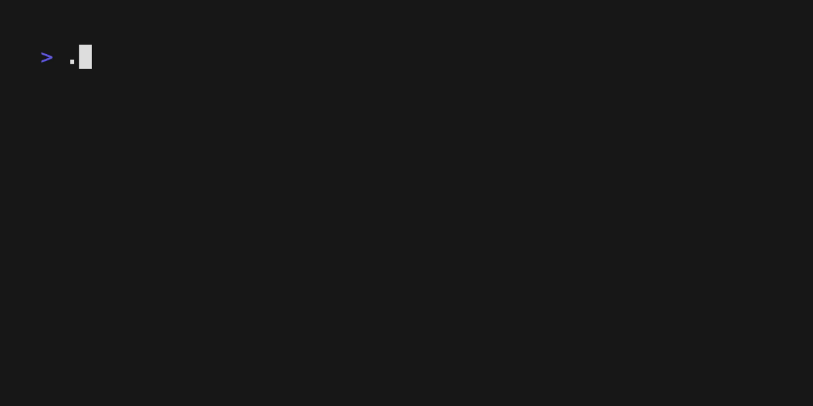

# Ask

A cli for the [survey](https://github.com/go-survey/survey) library, inspired by [gum](https://github.com/charmbracelet/gum).



## Installation

```bash
# brew
brew install pomdtr/tap/ask

# from source
go install github.com/pomdtr/ask@latest
```

Or download the packages from [github releases](https:github.com/pomdtr/ask/releases).

## Usage

### Ask for input

```bash
ask "What is your name?"
```

### Ask for password

```bash
ask --password "What is your password?"
```

### Ask for confirmation

```bash
ask --confirm "Are you sure?"
```

### Ask for selection

```bash
ls -1 | ask --select "Select a file:"
```

### Ask for long input

```bash
ask --edit "Write a commit message:"
```
